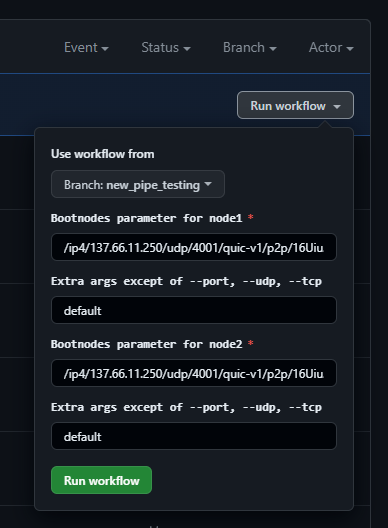

# How to use the GitHub actions workflow.

To configure the nodes and deploy them to GCP you should follow the next steps:

## Step 1. Edit the config.yaml file.

Config.yaml is the main configuration file for your nodes, you can specify here how the nodes will be connected to each other.

You can put the string with the parameters for each node like this:

```yaml

node1:
    bootnodes: "/ip4/137.66.11.250/udp/4001/quic-v1/p2p/16Uiu2HAmJtYy4A8pzChDQQLrPsu1SQU5apzCftCVaAjFk539CLc9,/ip4/168.220.95.86/udp/4001/quic-v1/p2p/16Uiu2HAmAb5Wac73G2QSQQfarhw95KveAaEUNX6yTXXpmmTtVmNW"
node2:
    bootnodes: "/ip4/137.66.11.250/udp/4001/quic-v1/p2p/16Uiu2HAmJtYy4A8pzChDQQLrPsu1SQU5apzCftCVaAjFk539CLc9,/ip4/168.220.95.86/udp/4001/quic-v1/p2p/16Uiu2HAmAb5Wac73G2QSQQfarhw95KveAaEUNX6yTXXpmmTtVmNW"

```

Or you can leave it blank like that:

```yaml

node3:
    bootnodes:
node4:
    bootnodes:

```

In this situation, the first node will always be the master node (node3), and the nodes below will be the slave nodes (node4). The traffic will be routed to the master node. You can specify as many nodes as you need (node5, node6...). Also, you can combine the nodes with the parameters string provided and with blank nodes.

After you specify the nodes and their parameters in config.yaml, you commit and push the changes to the repository.

## Step 2. Approve the Terraform apply.

The changes you made in config.yaml file triggered the terraform_build.yaml workflow and created the new issue for approval in your repo, which you should see at the issues tab of the repo.

Review the issue and the changes that will be made by Terraform and type "yes" in the comment section.

## Step 3. Merge the pull request.

After the previous step, your nodes are deployed to GCP. But these nodes are still not connected to each other. The terraform_build.yaml workflow has now created a new pull request with the new masa-oracle.yaml workflow file. Go to the pull request tab and merge the pull request.

## Step 4. Run the masa-oracle.yaml workflow.

Now you should go to the actions tab of the repository and run the masa-oracle.yaml workflow. Push the run workflow tab and here you can see the parameters we placed in the config.yaml:



You can leave it like it is or make some changes and push the Run workflow button.

## Conclusion.

Now your nodes are created and configured as you specified in config.yaml.


# How the workflow works.

## Config.yaml.

Here, you specify the amount of nodes you want to deploy and how they should be configured.

## terraform_build workflow.

When you push the config.yaml to the repo, this workflow is triggered.

The workflow steps: 

1) Retrieving the GCP credentials from secrets.

2) Add SSH keys / Create repo tar: the SSH keys are laid in the secrets of the repo, then the SSH keys are created as files with the data from the secret and then attached to the nodes deployed.

Also, this step creates the tar archive of the repo, and this archive is transferred to the nodes later, so they can use the files inside this archive.

2) Terraform apply.

The Terraform apply step takes the output from the terraform plan step and opens a new issue to approve the terraform apply command.

3) Pull request.

Terraform created a new workflow file called masa-oracle.yaml, so we need to merge the new pull request to add this file with updated inputs to our repo to then be able to configure our nodes.

## masa-oracle workflow.

This workflow is created by Terraform using the pipeline.tftpl template. It takes the inputs you entered and configures your nodes.

## /vm_node.

Here are the configuration files of the module for our nodes. 

We create a google_compute_address IPv4 address for each node and create the VMs as google_compute_instance resources.
In this resource, we specify the image, machine type, boot disk type, the IPv4 address that we created earlier, SSH keys, GitHub runner credentials, startup script and provisioners to transfer the files to our VM or run the commands. The GitHub runner is installed during the startup script. The remote-exec destroy provisioner uninstalls the GitHub runner from the VM and the repository when the instance is terminated. The file provisioner copies the tar archive from our repo into the VM. And the last provisioner unpacks the archive with the service files and runs masa-racle.service.

## /terraform_nodes.

Here we create a module from the /vm_node configuration files and create the masa-oracle workflow file, which is created from the template. Then we take the parameters from the config.yaml file and pass them into the nodes module and template file. Also, we create the google_compute_firewall resource to open the 22 port for SSH and then attach it to our instances.

The Terraform state file is stored in a bucket in GCP.
