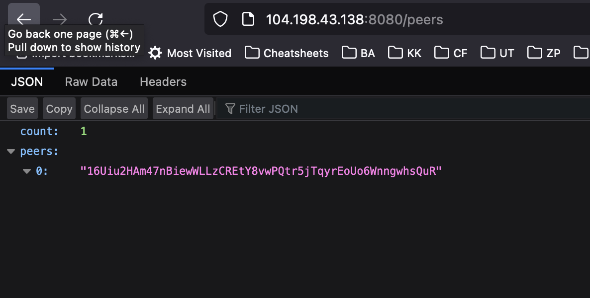
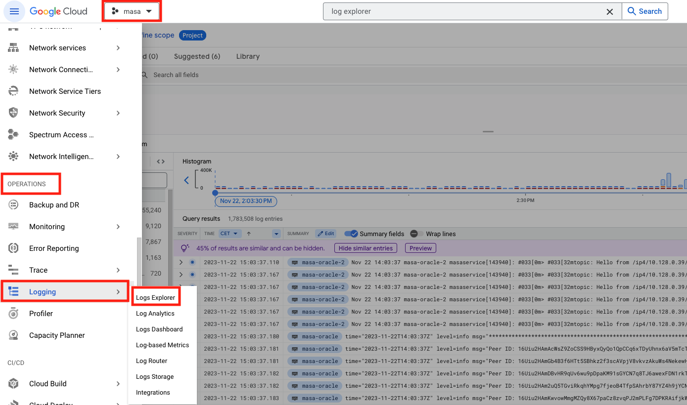
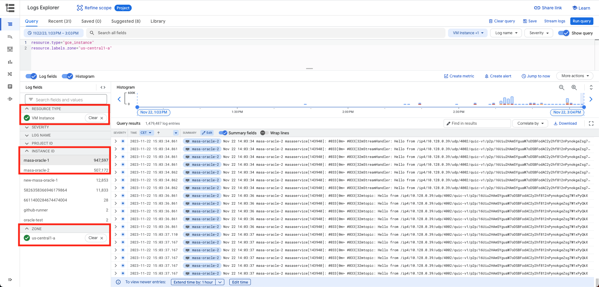

# Pipeline
This GitHub Actions workflow, named "Build and Deploy," is designed to facilitate the deployment of a Masa Oracle node with customizable bootnodes parameters. The pipeline consists of two jobs: "deploy" and "connect." The workflow is triggered manually through the GitHub Actions UI with user-provided parameters for bootnodes.

# Running a workflow manually
### 1. On GitHub.com, navigate to the main page of the repository.
### 2. Under your repository name, click  Actions.


### 3. In the left sidebar, click the name of the workflow you want to run.


### 4. Above the list of workflow runs, click the Run workflow button.
**Note:** To see the Run workflow button, your workflow file must use the ```workflow_dispatch``` event trigger. Only workflow files that use the ```workflow_dispatch``` event trigger will have the option to run the workflow manually using the Run workflow button. For more information about configuring the workflow_dispatch event, see ["Events that trigger workflows."](https://docs.github.com/en/actions/using-workflows/events-that-trigger-workflows#workflow_dispatch)


## Inputs
The workflow accepts the following inputs during manual triggering:
``` yaml
      node1argbootnode:
        description: "Bootnodes parameter for node 1"
        default: 'default'
        type: string
        required: true
      node1argextra:
        description: "Extra args except of --port, --udp, --tcp"
        default: ''
        type: string
        required: false
      node2argbootnode:
        description: "Bootnodes parameter for node 2"
        default: 'default'
        type: string
        required: true
      node2argextra:
        description: "Extra args except of --port, --udp, --tcp"
        default: ''
        type: string
        required: false
```

Specify in `Bootnodes parameter for node 1` multiadress of node to which you want to connect or leave it with default value in case if you are creating dedicated network.  
Specify in `Extra args except of --port, --udp, --tcp` extra arguments if needed  

## Dedicated peer network
If you want run a dedicated peer network, you should leave ```default``` in the fields. Then nodes will be connected with each other.
 - If you want connect to dedicated peer network, open actions pipeline, chose ```deploy``` job and expand ```Get host address``` field.
    - **Note:** You should see connection string with `private ip` address. Replace it with external ip adress of an node-1 instance. By default node-1 runs as boot-node.
      -  masa-oracle-node-1 (InstanceID: 7232336613034160816): 35.224.231.145
      -  masa-oracle-node-2 (InastanceID: 7239909623924515564): 104.198.43.138


## Joining nodes to the existing network
If you want join nodes to the existing network, you should run workflow and insert to the input fields connection strings. They should be sepparated by comma.  


**For example:** ```/ip4/137.66.11.250/udp/4001/quic-v1/p2p/16Uiu2HAmJtYy4A8pzChDQQLrPsu1SQU5apzCftCVaAjFk539CLc9,/ip4/168.220.95.86/udp/4001/quic-v1/p2p/16Uiu2HAmAb5Wac73G2QSQQfarhw95KveAaEUNX6yTXXpmmTtVmNW```

## Nodes external IPs and http requests

Please use these external IP adresses for connection to nodes (http, tcp, udp, quic)   
masa-oracle-node-1 `35.224.231.145`   
masa-oracle-node-2 `104.198.43.138`   

There are an example of http request ot one of the nodes    



## How to work with logs
### 1. Open Log Explorer service in Google Cloud Platform under `masa` project

### 2. Filter Logs
 - **Select desired:** 
    - **Resource type**
    - **Instance ID**
    - **Zone**


### You can also run query
Add next query and press run:
`
resource.type="gce_instance"
resource.labels.instance_id="${ID_HERE}"
resource.labels.zone="us-central1-a"
`

Replace `${ID_HERE}` with instance id
  -  masa-oracle-node-1 (InstanceID: 7232336613034160816)
  -  masa-oracle-node-2 (InastanceID: 7239909623924515564)

## 2. Chose log time range

